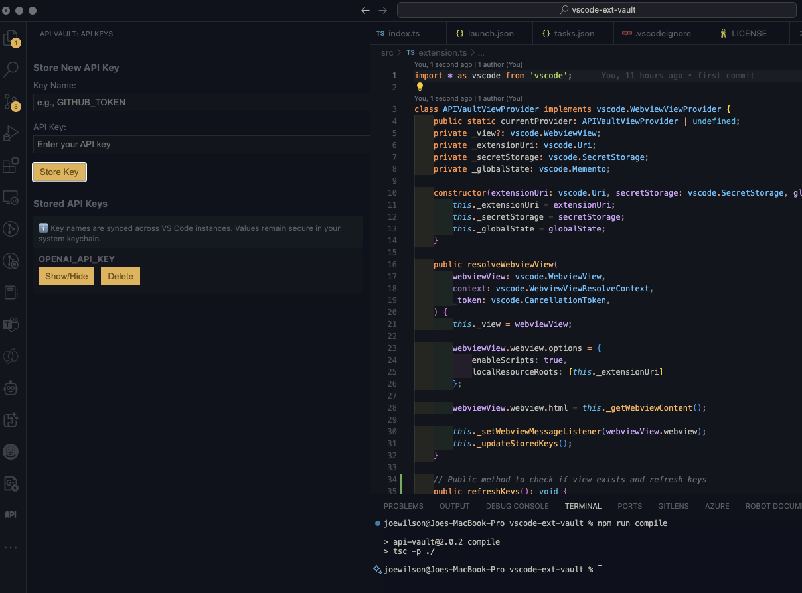

# API Vault for VS Code

A secure and convenient VS Code extension for managing your API keys directly from the Activity Bar, now with sync support across VS Code instances!

## Features

- 🔄 Sync API key names across VS Code instances
- 🔒 Securely store API keys using VS Code's built-in SecretStorage
- 🎯 Quick access from both Activity Bar and Command Palette
- 👀 Easy-to-use interface for managing all your API keys
- 🔑 Show/Hide functionality for viewing key values
- 🗑️ One-click deletion of stored keys
- 📋 Copy API keys directly to clipboard

## Installation

1. Install the extension from the VS Code Marketplace
2. Look for the API icon in the Activity Bar (left sidebar)
3. Click it to open the API Vault panel

## Syncing Support

API Vault 2.0 introduces syncing capabilities:
- API key names are synced across all your VS Code instances
- Key values remain secure in your local system keychain
- Enable VS Code Settings Sync to automatically sync key names
- Access your keys from any device while maintaining security

## Usage

### Opening API Vault
- Click the API icon in the Activity Bar (left sidebar)
- The API Vault panel will open, showing all your stored keys
- Alternatively, use the Command Palette (Cmd+Shift+P / Ctrl+Shift+P) and search for "API Vault"

### Storing a New API Key
1. In the API Vault panel, find the "Store New API Key" section at the top
2. Enter the key name (e.g., "GITHUB_TOKEN")
3. Enter the API key value
4. Click "Store Key"
5. The key name will sync across your VS Code instances

Alternatively, use the Command Palette:
1. Open Command Palette (Cmd+Shift+P / Ctrl+Shift+P)
2. Search for "API Vault: Store New API Key"
3. Follow the prompts to enter key name and value

### Viewing and Copying Stored Keys
- All your stored keys are automatically listed in the panel
- Click "Show/Hide" next to any key to view its value
- Click again to hide the value
- Use the dedicated copy button or Command Palette's "API Vault: Get API Key" to copy a key to clipboard
- Key names are synced, but values are stored securely in your local system keychain

### Managing Keys
- Use the Command Palette's "API Vault: List API Keys" for quick key management
- Select a key to view options for copying or deleting
- In the Activity Bar interface, use the "Delete" button next to any key
- Confirm the deletion when prompted
- The deletion will sync across your VS Code instances

## Security

API Vault uses a hybrid approach for maximum security and convenience:

### Key Names (Synced)
- Stored using VS Code's globalState
- Synced across instances via Settings Sync
- No sensitive information included

### Key Values (Secure)
- Stored using VS Code's SecretStorage API:
  - On macOS: System Keychain
  - On Windows: Windows Credential Manager
  - On Linux: System's secret service (libsecret)
- Never synced between instances
- Encrypted at rest
- Only accessible within VS Code

## Commands

API Vault provides convenient access through both the Activity Bar and Command Palette (Cmd+Shift+P / Ctrl+Shift+P):

- `API Vault: Store New API Key` - Store a new API key with a guided prompt interface
- `API Vault: Get API Key` - Quickly retrieve and copy a key to clipboard
- `API Vault: List API Keys` - View and manage your stored keys with copy/delete options

## Requirements

- VS Code version 1.85.0 or higher
- Settings Sync enabled (optional, for syncing key names)

## Extension Settings

This extension contributes no additional settings.

## Known Issues

None at this time.

## Release Notes

### 2.0.7
- Reverted to original icon for consistent branding
- Optimized icon display in Activity Bar

### 2.0.6
- Updated Activity Bar icon for improved visibility
- Refined visual appearance in the sidebar

### 2.0.5
- Updated extension icon for better visibility in the Activity Bar
- Enhanced visual consistency across the extension

### 2.0.4
- Added dedicated copy button with icon for each API key
- Enhanced UI with visual feedback when copying keys
- Improved accessibility for copying API keys

### 2.0.3
- Fixed Command Palette integration
- Improved sync between Activity Bar and Command Palette interfaces
- Enhanced clipboard support for quick key copying
- Updated documentation with comprehensive usage instructions

### 2.0.2
- Enhanced Command Palette integration
- Added clipboard support for quick key copying
- Improved key management through Command Palette
- Better sync between Activity Bar and Command Palette interfaces

### 2.0.0
Major update with syncing support:
- Added sync capability for API key names
- Improved security with hybrid storage approach
- Enhanced UI with sync status indicators
- Updated documentation for sync features

### 1.0.0
Initial release of API Vault:
- Activity Bar integration
- Secure key storage
- Webview interface
- Show/Hide functionality
- One-click deletion
- System keychain integration

## Contributing

Found a bug or have a feature request? Please open an issue on our [GitHub repository](https://github.com/PoliTwit1984/VSCode-API-Vault_Extension).

## License

This extension is licensed under the [MIT License](LICENSE).
