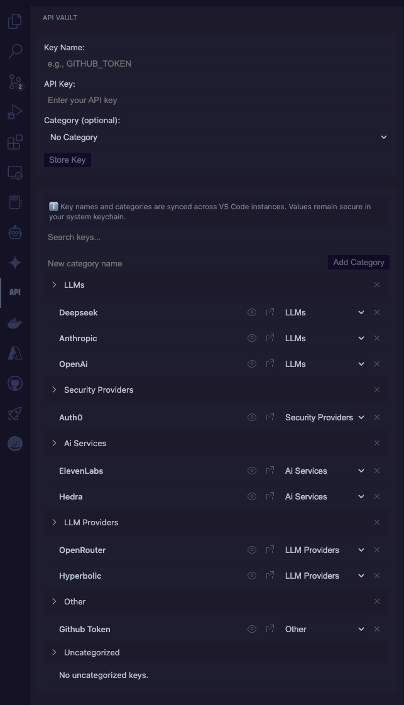

# 🔒 API Vault

**Manage your API keys with style!** API Vault brings a beautiful, intuitive interface right into VS Code, making it easier than ever to organize and access your API keys.

### 🎯 Organized & Secure
Keep your API keys neatly organized in collapsible categories:
- 🌥️ Cloud Services (AWS, Azure)
- 💳 Payment APIs (Stripe, PayPal)
- 🔗 Social Media (Twitter, Facebook)
- 🤖 AI & ML (OpenAI, HuggingFace)
- 🛠️ Development Tools (GitHub, GitLab)

## ✨ What's New in 4.0

We've completely redesigned API Vault to provide the best possible experience:

- 🎨 **Beautiful New Interface** - A joy to use, right in your editor
- 📁 **Smart Categories** - Organize keys your way with smooth collapsible sections
- 🎯 **Drag & Drop** - Effortlessly organize keys and categories
- 🔍 **Lightning-Fast Search** - Find any key instantly
- 💅 **Native Feel** - Perfectly integrated with VS Code

## 🚀 Features

### 🎯 Everything Where You Need It
- **Access keys instantly** without switching contexts
- **Copy with one click** directly into your code
- **Search and filter** to find keys quickly
- All your keys are **just a keystroke away**

### 🔐 Bank-Grade Security
- Keys are stored in your **system's secure keychain**
- **Zero plain-text storage** - everything is encrypted
- **No cloud sync** - your keys stay on your machine
- Follows security best practices

### 🎨 Smart Organization
- **Collapsible categories** for a clean workspace
- **Drag-and-drop** keys and categories anywhere
- **Custom categories** for perfect organization
- **Visual management** that makes sense

### 🚀 Perfect Integration
- **Native VS Code UI** - feels right at home
- **Keyboard shortcuts** for power users
- **Command palette** integration
- **Explorer view** for quick access

## 🎮 Getting Started

1. Install API Vault from the VS Code Marketplace
2. Click the vault icon in the Activity Bar
3. Start adding your API keys!

## ⌨️ Commands

- `API Vault: Store Key` - Add a new API key
- `API Vault: Get Key` - Retrieve and copy a key
- `API Vault: List Keys` - View all stored keys

## 🛡️ Security

API Vault uses your system's secure keychain (Keychain Access on macOS, Credential Manager on Windows, libsecret on Linux) to store your API keys. The keys are:

- ✅ **Encrypted at rest**
- ✅ **Protected by your system's security**
- ✅ **Never stored in plain text**
- ✅ **Never synced to the cloud**

## 🎯 Perfect For

- **Developers** managing multiple API keys
- **Teams** working with various services
- **Students** learning to use APIs
- **Anyone** who values security and convenience

## 📝 Feedback & Contributions

Love API Vault? Give it a ⭐️ on GitHub! Found a bug or have a feature request? [Open an issue](https://github.com/PoliTwit1984/VSCode-API-Vault_Extension/issues)!

## 📜 License

MIT License - feel free to use in your own projects!
